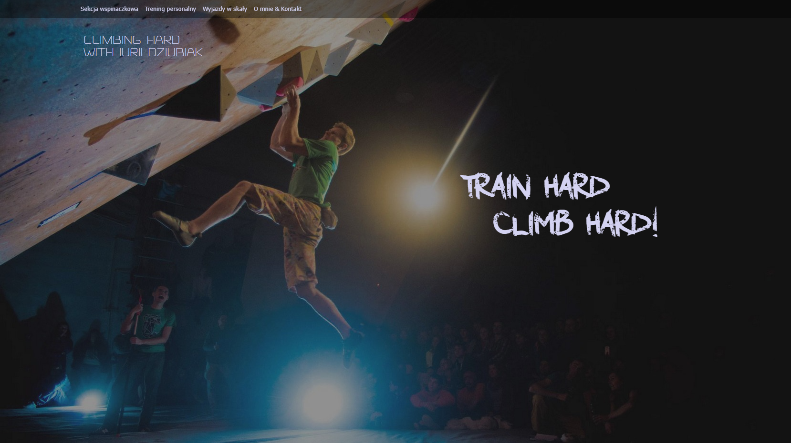

# Personal Web Page

### https://iurii-dziubiak.github

### Story
This is my first Web project, I had to learn how to build a single page web application. 
In the beginning, I was very discouraged because it seemed so complicated. 
Nevertheless, after some time I learned how to enjoy every step of my journey, 
I also became motivated to learn more and thought about this journey as start to become a Software Engineer.

### Things I learned while doing this project:
- HTML to determine the layout of webpage.
- CSS to determine the styling and visual appeal.
- JavaScript (in conjunction with the jQuery library) to make website interactive.
- Bootstrap to determine the responsive, mobile-first front-end web development.

### SKILLS

